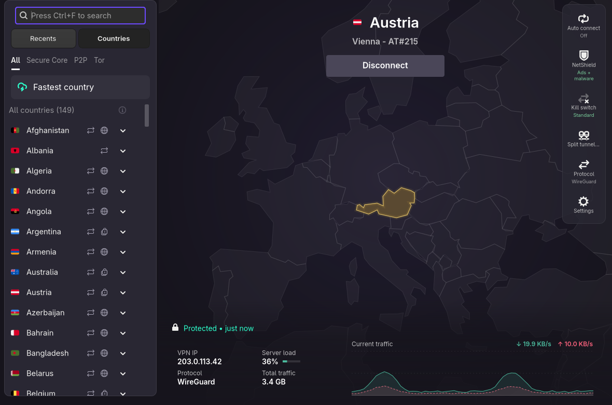
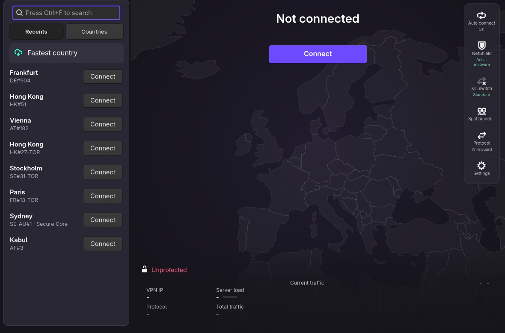
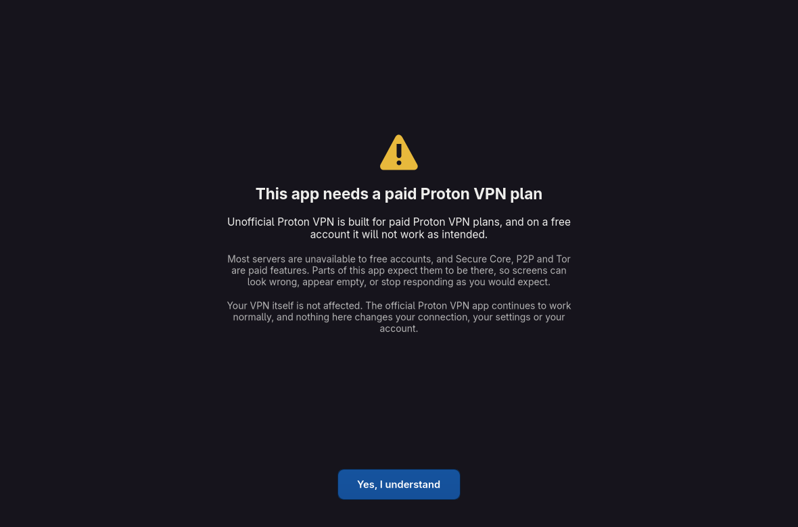

<div align="center">


# Unofficial Proton VPN

**Proton's Windows layout, on Linux.**

[](LICENSE)
[](#install)
[](#install)
[](#licence)

</div>

An alternative GUI for Proton VPN on Linux. It is not a fork and not a patch:
it reuses Proton's own officially installed VPN backend, unmodified, and lays
it out the way their Windows app does. A map that follows your connection, a
live traffic chart, recents, and the settings you actually change kept one
click away.

If you are looking for a Proton VPN desktop frontend, custom client, or a way
to get the Windows interface on Fedora and other distributions, that is what
this is.

Beta, and honest about it: see [Limitations](#limitations).

## Install

You need the official Proton VPN Linux app (`proton-vpn-gnome-desktop`)
installed and working, a **paid** Proton plan, and GTK 4.14 or newer.

```bash
git clone https://github.com/salie28/unofficial-proton-vpn-for-fedora
cd unofficial-proton-vpn-for-fedora && ./install.sh
```

No root. The installer writes exactly two things into your home directory: the
icons into `~/.local/share/icons/hicolor/*/apps/`, and the launcher into
`~/.local/share/applications/`. Then launch **Unofficial Proton VPN** from your
applications menu.

Uninstall with `./uninstall.sh`, or delete those two things yourself.



| Recents | Free accounts |
|---|---|
|  |  |

## What it adds

The official Linux client is a single narrow column. This lays the same
functionality out the way Proton's Windows app does, and fills in a few gaps:

- **A map** that highlights the country you are connected to and travels to
  it. Places too small to outline, or that are not separate countries, are
  marked at the server's own coordinates instead.
- **A traffic chart** with live download and upload, server load, VPN IP and
  protocol, read straight from the tunnel interface.
- **Recents.** The official Linux app has no recents list; this keeps its own.
- **A quick-access rail** for auto connect, NetShield, kill switch, split
  tunnelling and protocol, so the settings you actually change are one click
  away instead of buried in a settings window. Each explains itself on hover.
- **Auto connect** that can pin the country or server you are already on, so
  there is no list to hunt through and no country code to remember.
- **A tray menu** with live throughput, quick connect, and your last servers.

## Will this break my VPN?

No, and not by carefulness: by structure.

Your tunnel is a NetworkManager connection, and the kill switch is a separate
NetworkManager device. Both are held by NetworkManager and the root daemon
`me.proton.vpn.split_tunneling.service`. **No GUI holds the tunnel up**, so no
GUI, this one included, can drop it, leak traffic, or disable a kill switch.

On top of that, this app:

- never writes to Proton's files, `site-packages`, or their `settings.json`
- installs nothing as root: no systemd units, no NetworkManager configuration,
  no system DBus services
- never reimplements connection logic. Every connect and disconnect is a call
  into Proton's own controller
- keeps its own settings in `~/.config/unofficial-protonvpn/`

You can check Proton's install is untouched at any time:

```bash
rpm -V proton-vpn-gtk-app
```

Empty output means nothing was modified.

## Running it alongside the official app

Both can be installed at once; they are separate applications with separate
icons. Run only **one at a time**. They share the same root daemon and the same
NetworkManager connection, so only one should be driving the tunnel.

## Limitations

Worth knowing before you install:

- **Paid plans only.** Free accounts are warned rather than blocked, but most
  servers and features are unavailable to them.
- **English only.** The official app is translated; this one is not.
- **Tied to Proton's internals.** This composes their widget classes, not just
  their stylesheet, so their updates can break it. When that happens it says so
  plainly instead of showing a broken window, and the official app keeps
  working regardless.
- **Not packaged.** No RPM and no repository; it is a clone and a script.
- **Young.** Used daily, but not yet tested widely. Expect rough edges.

## Development

```bash
python3 -m unittest discover -s tests     # 214 tests
tools/dev-restart.sh                      # restart the app safely
python3 tools/render.py --out shot.png --connected --traffic --real-servers
```

`tools/render.py` draws the interface to a PNG without a display, which is how
the screenshots above are made and how layout changes are checked.

[CONTRIBUTING.md](CONTRIBUTING.md) covers the rules this project holds to,
[SECURITY.md](SECURITY.md) explains which problems belong here and which belong
to Proton, and [CHANGELOG.md](CHANGELOG.md) records what changed.

## Licence

GPL-3.0, the same licence as the Proton VPN Linux app it builds on, with
Proton's copyright retained. See [LICENSE](LICENSE) and [COPYRIGHT](COPYRIGHT).

Proton's name and logos are their trademarks and are not covered by that
licence. This project ships its own icon, in its own colours, but it is
deliberately in the same visual family as Proton's mark and should be
considered a placeholder rather than a settled piece of branding.

Country outlines are derived from [Natural Earth](https://www.naturalearthdata.com/),
which places its data in the public domain.
